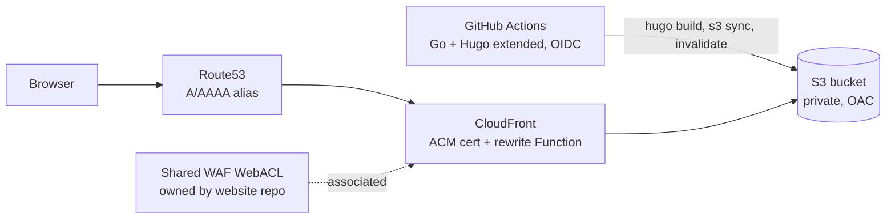

# blog

Source for [blog.rickwaterman.com](https://blog.rickwaterman.com) — Rick Waterman's
personal blog: essays on cloud architecture, AWS, and engineering leadership. Built with
[Hugo](https://gohugo.io/) and the [Congo](https://jpanther.github.io/congo/) theme
(installed as a Hugo Module), deployed to S3 + CloudFront with AWS CDK. It is a sibling of
[`website`](https://github.com/rwaterman/website) and
[`notes`](https://github.com/rwaterman/notes), which share the same deployment pattern and
account-wide infrastructure.

## Requirements

- Hugo **extended** — CI pins `0.165.0` in `.github/workflows/deploy.yml`; `brew install hugo`
- Go — `go.mod` declares `1.26.4`; CI uses `go-version-file: go.mod`; `brew install go`
- Node.js + npm — infra deploy uses `npm ci` / `npx cdk`; CI uses Node `22`
- AWS CLI + CDK bootstrap in `us-west-2` and `us-east-1` for infra work

## Develop

```sh
hugo mod get          # fetch / update the Congo theme module
hugo server -D        # local preview with drafts at http://localhost:1313
```

## Write a post

Posts are leaf page bundles under `content/posts/<slug>/index.md`, so images can sit
alongside the article:

```sh
hugo new content posts/my-first-post/index.md
```

`archetypes/posts.md` scaffolds the front matter (`summary`, `tags`, `categories`,
`series`, `ai_model`) and the `ai-disclosure` shortcode. Fill it in and set `draft = false`
when ready. `series` is a taxonomy for multi-part posts — set the same value on each part
and Hugo generates `/series/<name>/`; leave it commented out otherwise.

### AI writing-assistance disclosure

Every AI-drafted post carries two badges — **LLM Drafted** (robot icon) and the model
name (microchip icon) — plus a callout and a byline credit. All of it keys off one front
matter field:

```toml
ai_model = "Claude Fable 5 (Anthropic)"
```

Setting `ai_model` renders the badge pair (`layouts/_partials/ai-badges.html`) in the
post header's meta row and on every list card (posts index, home page recent articles,
tag/category pages) via the `layouts/_partials/article-meta.html` override, and credits
the model at the bottom of the article above the author byline via the
`layouts/_partials/author.html` override. The badge text is the `ai_model` value verbatim.

To repeat the badges inside the article body with a short disclosure, drop the
`ai-disclosure` shortcode in as the first line of the post body:

```md

```

It renders a lightbulb-icon callout (styled to match Congo's `alert`) with the badge pair
above the message. Pass a string to override the default message, e.g.
``.
The shortcode lives in `layouts/_shortcodes/ai-disclosure.html`.

The badge icons are Font Awesome Free (CC BY 4.0) SVGs in `assets/icons/`, the same
source and format Congo uses for its bundled icons.

## Site features

Beyond Congo's defaults (search, code copy, TOC, breadcrumbs, reading time, tag/category
pages), the site layers on:

- **Archive timeline** — every post grouped year → month in a right-hand column on the
  home page and `/posts/` (stacks below the list on small screens).
  `layouts/_partials/archive-timeline.html`, wired in by the `home/page.html` and
  `list.html` overrides. `/posts/` itself groups by year (`list.groupByYear`).
- **Related posts** — up to three under each article, after the previous/next links, from
  Hugo's [Related Content](https://gohugo.io/content-management/related/) weighted by
  `series` > `tags` > `categories` > date (`[related]` in `hugo.toml`).
  `layouts/_partials/article-pagination.html` override.
- **Updated dates from git** — `enableGitInfo` + `[frontmatter] lastmod` derive each post's
  `Lastmod` from its last commit (a `lastmod` front matter value wins). Congo shows an
  "updated" date only when it differs from the publish date. CI checks out full history
  (`fetch-depth: 0`) so this works in the build.
- **Full-content RSS** — `layouts/rss.xml` adds `<content:encoded>` with the whole article
  so feed readers do not have to click through.
- **Sharing links** on each post (`article.sharingLinks`).
- **Analytics** — Congo supports Fathom, Plausible and Umami (`params.toml`); none is
  enabled until an id is filled in. Congo only injects the script when
  `hugo.IsProduction`, and `deploy.yml` builds dev with `--environment development`, so dev
  never reports.

## Build

```sh
hugo --gc --minify    # outputs the static site to ./public (CI adds --baseURL per env)
```

RSS (`/index.xml`, full article content) and `sitemap.xml` are generated automatically.

## Configuration

Site config lives in `config/_default/` (Congo's recommended split layout):
`hugo.toml`, `params.toml`, `languages.en.toml`, `menus.en.toml`, `markup.toml`,
`taxonomies.toml`, and `module.toml` (the theme import). It was seeded from Congo's
`exampleSite` config and then customized — see the
[Congo docs](https://jpanther.github.io/congo/docs/configuration/) for every parameter.
`baseURL` in `hugo.toml` is the prod value; CI overrides it per environment.

## Layout

```
content/
  _index.md, about.md
  posts/<slug>/index.md     leaf bundles, images alongside
config/_default/            Hugo + Congo config (split layout)
assets/icons/               robot.svg, microchip.svg (AI badge icons)
layouts/
  list.html                     Congo override: archive timeline beside section lists
  rss.xml                       Hugo override: full-content feed
  _partials/archive-timeline.html   year → month → post links
  _partials/home/page.html      Congo override: archive timeline beside home content
  _partials/article-pagination.html Congo override: prev/next + related posts
  _partials/ai-badges.html      "LLM Drafted" + model badges (from ai_model)
  _partials/article-meta.html   Congo override: badges in post header + list cards
  _partials/author.html         byline override (ai_model credit)
  _shortcodes/ai-disclosure.html
archetypes/                 default.md, posts.md (front matter + ai-disclosure scaffold)
go.mod, go.sum              pins Congo v2 as a Hugo Module
infra/                      AWS CDK app (TypeScript)
  bin/blog.ts
  lib/shared-stack.ts     blog-infra-deploy role, imports shared OIDC provider (us-west-2)
  lib/cert-stack.ts       per-env ACM certificate (us-east-1)
  lib/site-stack.ts       one environment (us-west-2)
  lib/site-config.ts        SITE_ENVS, account/region/zone
.github/workflows/
  deploy.yml                build + publish content
  infra.yml                 cdk deploy
```

## Architecture



The home region is `us-west-2`; everything that can live there does (bucket,
distribution, roles, SSM). CloudFront requires its ACM certificate in `us-east-1`, so
each environment gets a thin `BlogCert<Env>` stack there whose certificate is passed to the
home-region site stack with CDK `crossRegionReferences`. DNS is the `rickwaterman.com`
hosted zone.

| Stack | Region | Contents |
| --- | --- | --- |
| `BlogShared` | us-west-2 | `blog-infra-deploy` role (imports the website repo's OIDC provider) |
| `BlogCert<Env>` | us-east-1 | That environment's DNS-validated ACM certificate |
| `BlogSite<Env>` | us-west-2 | Bucket, distribution, DNS, content role, SSM params |

### `BlogShared`

Imports the account-wide GitHub OIDC provider (created once by the `website` repo's
`WebsiteShared` stack) and creates the `blog-infra-deploy` role that `infra.yml` assumes
from `develop`. The role has no service permissions of its own — it can only assume the
CDK bootstrap roles in both regions.

### `BlogSite<Env>`

| Env | Stack | Domain | Deploys from | Content role |
| --- | --- | --- | --- | --- |
| dev | `BlogSiteDev` | `blog-dev.rickwaterman.com` | `develop` | `blog-content-dev` |
| prod | `BlogSiteProd` | `blog.rickwaterman.com` | `main` | `blog-content-prod` |

Each environment stack creates: a private, encrypted S3 bucket (prod: `RETAIN`, dev:
destroy + auto-empty); a CloudFront distribution with Origin Access Control, a
viewer-request CloudFront Function for Hugo's directory-index URLs, and 403/404 mapped to
`/404.html`; Route53 A/AAAA alias records; a
branch-scoped OIDC role that may only write to that environment's bucket and invalidate
its distribution; and SSM parameters `/blog/<env>/bucket-name` and
`/blog/<env>/distribution-id` that the deploy workflow resolves at run time.

The distribution attaches the shared CloudFront WebACL (geo-block of sanctioned
countries, per-IP rate limit, AWS IP-reputation list) by reading its ARN from SSM
`/website/shared/cloudfront-webacl-arn` (us-west-2) as a CloudFormation dynamic reference resolved at
deployment time, so WAF rules are defined in one place for all three sites.

## CI/CD

Both workflows use OIDC (`id-token: write`); no long-lived AWS keys exist.

- **`deploy.yml`** — on push to `develop` (→ dev) or `main` (→ prod), or
  `workflow_dispatch` with an `env` choice (dispatch from `develop` for `dev`, `main` for
  `prod`, to match the branch-scoped OIDC trust policy). Checks out full history (for
  git-derived `Lastmod`), installs Go (from `go.mod`) and Hugo extended (pinned
  `HUGO_VERSION`), fetches the Congo module, runs
  `hugo --gc --minify --environment <production|development> --baseURL https://<host>/`,
  writes a `Disallow: /` `robots.txt` on dev, assumes `blog-content-<env>`, syncs
  `public/` to S3 with `must-revalidate` cache headers, then invalidates `/*`. Needs
  secret `AWS_ACCOUNT_ID`.
- **`infra.yml`** — on push to `develop` touching `infra/**` or
  `.github/workflows/infra.yml`, plus `workflow_dispatch`. Assumes `blog-infra-deploy` and
  runs `cdk deploy --all` — every stack, dev **and** prod. Infra has no `main` path; only
  content promotion follows `main`. Needs secrets `AWS_ACCOUNT_ID` and `HOSTED_ZONE_ID`.

Unlike the Node-based siblings, the build needs Go plus a network fetch of the Hugo
Module; `go.mod`/`go.sum` pin the theme so CI is reproducible.

Branching follows git flow: feature branches → `develop` (dev), releases → `main` (prod).

### First-time / local infra deploy

`blog-infra-deploy` is created by `BlogShared`, so the very first deploy runs locally
with admin credentials, after the `website` repo's `WebsiteShared` stack exists:

Both regions must be CDK-bootstrapped.

```sh
cd infra && npm ci
AWS_ACCOUNT_ID=<account> HOSTED_ZONE_ID=<zoneId> npx cdk deploy --all --require-approval never
```
